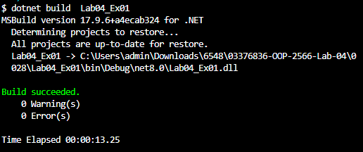
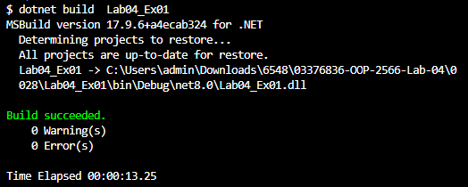

## บันทึกผลที่ได้จากการรันคำสั่งในข้อ 3

## บันทึกผลที่ได้จากการรันคำสั่งในข้อ 4

## อธิบายสิ่งที่พบในการทดลอง
เนื่องจากไม่ได้ทำการกำหนดค่าให้ ตัวแปร คอมไพล์จึงแสดงข้อผิดพลาดเพื่อป้องกันปัญหาที่อาจเกิดขึ้น
อาจต้องเพิ่มค่าให้ตัวแปร เช่น
int var1 = 10;
int var2 = 20;
float var3 = 3.14;
string var4 = "Hello": 