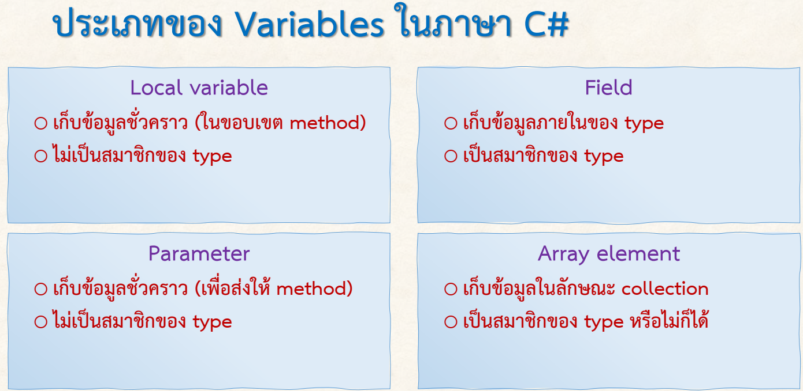
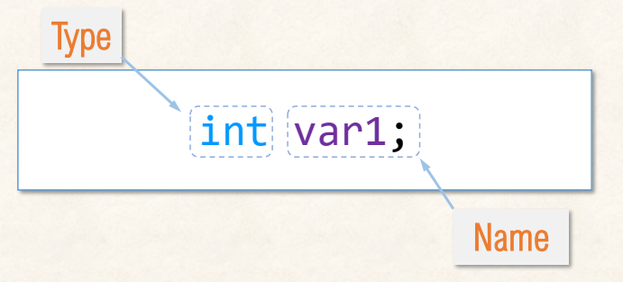

# 03376836-OOP-2566-Lab-04
C# Variables
# การประกาศตัวแปร Variable declaration

## ตัวแปรในภาษา C#  มี 4 ประเภท

|ลำดับที่|ประเภท|การใช้งาน|
|-------|----------|-----|
|1|Local variable | ใช้ในขอบเขตของ method |
|2| Field |ใช้ในขอบเขตของ type |
|3| Parameter  |ใช้ส่งค่าไปให้ method มีขอบเขตภายใน method  |
|4| Array | ใช้ได้ทุกที่ (ทั้งใน method และ type)  |

## รูปแบบการตัวแปรในภาษา  

- คอมไพเลอร์จะสร้างพื้นที่เก็บข้อมูลตาม type ที่กำหนด
- เมื่อกำหนด type  ให้กับตัวแปรแล้วจะไม่สามารถเปลี่ยนชนิดได้อีก

## การเตรียมการทดลอง
1. Fork repository มาไว้ใน account ตนเอง
2. Clone repository มาไว้ใน folder บน harddisk ของตนเอง
3. สร้าง folder ย่อยที่มีรหัสของตนเองใน repo ที่ clone มา
4. เรียก vscode และเปิด folder ที่ clone มาใน vscode
5. เรียก terminal panel ใน vscode เพื่อเตรียมสร้าง project
6. พิมพ์คำสั่ง `dotnet new gitignore` เพื่อไม่ต้องส่งไฟล์ที่เกิดจากการ build ขึ้นบน guthub
