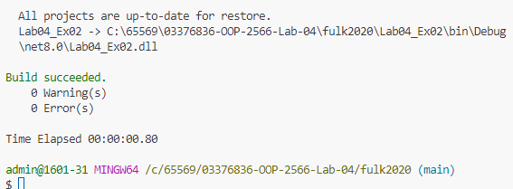
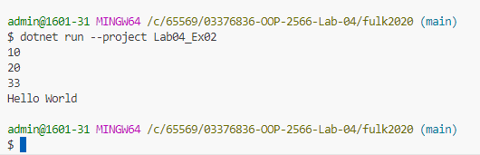

System.Console.WriteLine(var1);: แสดงค่าของ var1 ซึ่งเป็น 10.
System.Console.WriteLine(var2);: แสดงค่าของ var2 ซึ่งเป็น 20.
System.Console.WriteLine(var3);: แสดงค่าของ var3 ซึ่งเป็น 33.0.
System.Console.WriteLine(var4);: แสดงค่าของ var4 ซึ่งเป็น "Hello World"