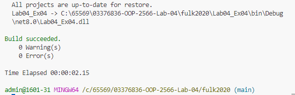
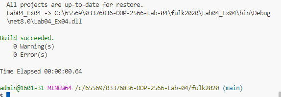

System.Console.WriteLine($"Value of var1 = {var1}");: แสดงค่าของ var1 ซึ่งเป็น 10.
System.Console.WriteLine($"Value of var2 = {var2}");: แสดงค่าของ var2 ซึ่งเป็น 10 (เท่ากับ var1).
System.Console.WriteLine($"Value of var3 = {var3}");: แสดงค่าของ var3 ซึ่งเป็น 20 (ผลบวกของ var1 กับ var2).
System.Console.WriteLine($"Type of var1 = {var1.GetType()}");: แสดงประเภทของ var1 ซึ่งเป็น System.Int32 (ประเภทของตัวแปร int).
System.Console.WriteLine($"Type of var2 = {var2.GetType()}");: แสดงประเภทของ var2 ซึ่งเป็น System.Int32 (ประเภทของตัวแปร int).
System.Console.WriteLine($"Type of var3 = {var3.GetType()}");: แสดงประเภทของ var3 ซึ่งเป็น System.Int32 (ประเภทของผลลัพธ์ที่ได้จากการบวก var1 กับ var2).